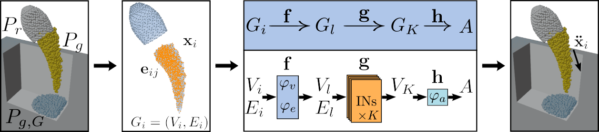

# Manipulation of granular materials by learning particle interactions

Neea Tuomainen*, David Blanco-Mulero*, Ville Kyrki,  IEEE Robotics and Automation Letters 2022. `*` Indicates equal contribution.

[Website](https://sites.google.com/view/granular-gnn-manipulation) / [IEEE paper](https://ieeexplore.ieee.org/document/9732690)

 


If you used our code, please consider citing:
```
@article{tuomainen2022manipulation,
  author={Tuomainen, Neea and Blanco-Mulero, David and Kyrki, Ville},
  journal={IEEE Robotics and Automation Letters}, 
  title={Manipulation of Granular Materials by Learning Particle Interactions}, 
  year={2022},
  volume={7},
  number={2},
  pages={5663-5670},
  doi={10.1109/LRA.2022.3158382}
}
```


# Table of Contents
- 1 [Installation](#installation)-
  - 1.1 [Cloning the repository](#cloning-the-repository)
  - 1.2 [Conda installation](#conda-installation)
  - 1.3 [Installation for visualisation](#installation-for-visualisation)
- 2 [Graph Neural Network (GNN) dynamics model](#graph-neural-network-gnn-dynamics-model)
  - 2.1 [Downloading the dataset](#downloading-the-dataset)
  - 2.2 [Training a new GNN model](#training-a-new-gnn-model)
  - 2.3 [Testing the model](#testing-the-model)
  - 2.4 [Visualising the results](#visualising-the-results)
- 3 [Planning of manipulation trajectories using CMAES and a trained GNN model](#planning-of-manipulation-trajectories-using-cmaes-and-a-trained-gnn-model)

# Installation

## Cloning the repository
You can clone the repository with all the dependencies using
```shell
git clone --recurse-submodules git@version.aalto.fi:mulerod1/gnn-manip.git
```

If you have already cloned the repository, remove the deps folder and update the submodules
```shell
rm -r deps
git submodule update --init --recursive
```

## Conda installation
Install conda if required ([instructions for Linux](https://conda.io/projects/conda/en/latest/user-guide/install/linux.html)). 

Create a conda environment using the requirements file
```
 conda env create -f environment.yml
 ```
Verify that PyTorch Geometric is installed
`conda env list`

Install pytorch-gnet dependency

```
cd deps/pytorch-gnet/
~/anaconda/envs/gnn-manip/bin/pip install -e .
```

## Installation for visualisation

You need to download and install blenderpy.
First install the required libraries.
```shell
sudo apt install build-essential git subversion cmake libx11-dev libxxf86vm-dev libxcursor-dev libxi-dev libxrandr-dev libxinerama-dev libglew-dev
```
Then clone Blender and the prebuilt libraries
```shell
mkdir ~/blender-git
cd ~/blender-git
git clone https://git.blender.org/blender.git
mkdir ~/blender-git/lib
cd ~/blender-git/lib
svn checkout https://svn.blender.org/svnroot/bf-blender/trunk/lib/linux_centos7_x86_64
```

Update and [build Blender as a Python module](https://wiki.blender.org/wiki/Building_Blender/Other/BlenderAsPyModule)
```shell
cd ~/blender-git/blender
make update 
make bpy
```

Finally, build the python bpy package using the prebuilt bpy version

```shell
pip3 install . --global-option="build_ext" --global-option="--bpy-prebuilt=/home/mulerod1/repos/blenderpy/Blender/build_linux_bpy/bin/" -v
```


# Graph Neural Network (GNN) dynamics model
 

## Downloading the dataset
You can download the dataset from
```shell
wget --no-check-certificate 'https://docs.google.com/uc?export=download&id=1gwS2b_3lgGTQCMMyctfF8MD_IiR0GFSl' -O coffee_dataset.tar.xz
```

## Training a new GNN model


Suppose you have a dataset saved in `datasets/coffee/` and you wish to save your model to directory `models/`. Then you may run training for the model with
```
python3 examples/train_sand_dyn.py -d 'datasets/coffee/' --model_dir 'models/' -c --device 'cuda:0'
```
If you wish to resume training of already saved model, you may do so with
```
python3 examples/train_dyn.py -d 'datasets/coffee/' --model_dir 'models/' --load_model PATH_TO_MODEL_FILE -c --device 'cuda:0'
```
List of possible arguments for training

| Argument                         | Type  | Description                                                                                                |
|----------------------------------|-------|------------------------------------------------------------------------------------------------------------|
| -d --data_dir PATH_TO_DATASET    | str   | Path to dataset.                                                                                           |
| --model_dir PATH_TO_MODEL_DIR    | str   | Path to directory where models are saved.                                                                  |
| --load_model PATH_TO_MODEL_FILE  | str   | Path to model whose training is resumed. Default None.                                                     |
| -c --use_control                 |       | Use control inputs in node attributes                                                                      |
| --k_steps K_STEPS                | int   | Previous k positions used to compute node attributes. Default 6.                                           |
| --conn_r CONN_R                  | float | Connectivity radius used to create edges. Default 0.015.                                                   |
| --max_neighbours MAX_NEIGHBOURS  | int   | Maximum number of neighbours for each node in graph. Default 20.                                           |
| --noise_std NOISE_STD            | float | Noise standard deviation for random walk noise added to particle positions. Default None.                  |
| --message_steps MESSAGE_STEPS    | int   | Number of message passing steps. Default 10.                                                               |
| --hidden_size HIDDEN_SIZE        | int   | Size of the hidden layers in MLPs. Default 128.                                                            |
| --num_layers NUM_LAYERS          | int   | Number of layers in MLPs. Default 2.                                                                       |
| -e --epochs EPOCHS               | int   | Number of epochs to train. Default 1000.                                                                   |
| -b --batch_size BATCH_SIZE       | int   | Batch size. Default 2.                                                                                     |
| --lr LR                          | float | Initial learning rate. Default 1e-4.                                                                       |
| --lr_decay_final FINAL_LR        | float | Final learning rate value when using linear learning rate decay. Default None.                             |
| --use_exp_lr_decay               |       | Use exponential learning rate decay.                                                                       |
| --gamma GAMMA                    | float | Gamma for exponential learning rate. Default 0.997                                                         |
| --use_updated_loss               |       | Use loss that considers only coffee particles.                                                               |
| --print_info                     |       | Prints information about training process.                                                                 |
| --test_model                     |       | Test the model in training at the end of each epoch.                                                       |
| --device DEVICE                  | str   | Device used to run the training. Options: 'cpu', 'cuda:0', 'cuda:1'. Recommended: 'cuda:0'. Default 'cpu'. |
| --seed SEED                      | int   | Random seed used in training and processing dataset. Default 123.                                          |
| --save_freq SAVE_FREQ            | int   | Save the model every SAVE_FREQ epochs. Default 100.                                                        |

## Testing the model
Comparison of ground-truth (left) vs GNN rollout (right). 

 

You may generate rollout predictions from test simulation with
```
python3 scripts/rollout_dyn.py -c -d PATH_TO_DATASET -m PATH_TO_MODEL --device 'cuda:0' --sim_id SIMULATION_ID
```
This saves ground-truth position and predicted rollout position of each particle for each frame. 

List of possible arguments for rollout generation

| Argument                         | Type  | Description                                                                                                |
|----------------------------------|-------|------------------------------------------------------------------------------------------------------------|
| -c --use_control                 |       | Use control inputs in node attributes.                                                                     |
| -pr --predict_rigids             |       | Predict rigid body accelerations.                                                                          |
| --k_steps K_STEPS                | int   | Previous k positions used to compute node attributes. Default 6.                                           |
| --conn_r CONN_R                  | float | Connectivity radius used to create edges. Default 0.015.                                                   |
| --max_neighbours MAX_NEIGHBOURS  | int   | Maximum number of neighbours for each node in graph. Default 20.                                           |
| --message_steps MESSAGE_STEPS    | int   | Number of message passing steps. Default 10.                                                               |
| --hidden_size HIDDEN_SIZE        | int   | Size of the hidden layers in MLPs. Default 128.                                                            |
| --num_layers NUM_LAYERS          | int   | Number of layers in MLPs. Default 2.                                                                       |
| -d --data_dir PATH_TO_DATASET    | str   | Path to dataset.                                                                                           |
| -m --model PATH_TO_MODEL_FILE    | str   | Path to model file.                                                                                        |
| --rd --rollout_dir ROLLOUT_DIR   | str   | Path to directory where rollouts are saved. Default ''                                                     |
| --sim_id SIMULATION_ID           | int   | Index of test simulation for which rollout is generated. Default 1.                                        |
| --device DEVICE                  | str   | Device used to run the training. Options: 'cpu', 'cuda:0', 'cuda:1'. Recommended: 'cuda:0'. Default 'cpu'. |

We have included code for generating a visualization of 3D data using Blender. You may generate the visualization with
```
python3 scripts/render_dyn.py --blender_file 'scripts/render_dyn_blender.py' --file_name 'prediction.npy' --output OUTPUT_DIR
python3 scripts/render_dyn.py --file_name 'prediction.npy' --output OUTPUT_DIR -c --device 'cuda:0' -d PATH_TO_DATASET -m PATH_TO_MODEL
python scripts/render_dyn.py --file_name 'prediction.npy' -c --device 'cuda:0' -d ~/gnn-manip/dataset/coffee-new3D-v2/ -m ~/gnn-manip/models/model.pth --output OUTPUT_DIR 
```
This renders visualization of given data with Blender and saves the rendered frames to `OUTPUT_DIR` as .pngs. Notice that this assumes that you have Blender installed and added to path.

You can also visualize the data generated using Taichi by running
```
python3 examples/render_dyn_blender.py --file_name positions.csv --output output_dir  --save_ffmpeg --start 100 --end 400
```

## Visualising the results
You may test one or more models on whole test data with
```
python3 scripts/plot_rmses.py --dir PATH_TO_DATASET --models PATH_TO_MODEL_V1 PATH_TO_MODEL_V2 --device 'cuda:0' -c 1 1 --labels 'Model V1' 'Model V2' --nof_sims NUMBER_OF_SIMS --message_steps 10 10 --k_steps 6 6
```
This plots Wasserstein distance of sand distributions for each simulation and each given model and saves data needed to plot boxplot of this to file `bxp_wasser.json`.


```shell
python scripts/render_sand_dyn.py -c --device cuda:0 -d ~/gnn-manip/dataset/coffee/ -m ~/gnn-manip/models/model.pth --plot --output ~/gnn-manip/dataset/coffee/results_1/ --sim_id 1
```

# Planning of manipulation trajectories using CMAES and a trained GNN model

In order to run the CMA-ES for planning the trajectory we need to define the following:
- d: folder containing the granular material dataset
- model_path: folder containing the trained GNN model to be loaded
- c: use control inputs in node attributes.
- sample_traj: initial sample trajectory to start the CMA-ES planning 
- m_steps: Number of message steps in the GNN model
- test_list: IDs of the target configuration of the granular material
- max_rot: maximum rotation allowed for the planning
- max_ty: maximum translation in the Y coordinate for the planning
- scale_rot: scaling factor used for the rotation to normalise the CMA-ES proposed trajectory
- scale_ty: scaling factor used for the translation to normalise the CMA-ES proposed trajectory
- cma_penalty: alpha constant applied in the CMA-ES objective function
- cma_gamma: gamma constant appleid in the CMA-ES objective function
- cma_iter: number of CMA-ES iterations to perform
- cma_popsize: CMA-ES population size
- cma_var: initial variance for the CMA-ES trajectory

```shell
python examples/optimise_traj.py -d ~/gnn-manip/dataset/coffee/ -c -m ~/gnn-manip/models/model.pth \
--sample_traj ~/gnn-manip/dataset/sample_traj.npy --m_steps 10 --test_list 1 2 --scale_rot 0.05 --scale_ty 0.0035 \
--max_rot 3 --max_ty 0.002 --device cuda:0 --cma_iter 50 \
--cma_gamma 1.0 --cma_penalty 1.0  --cma_popsize 40  --cma_var 1.5
```

